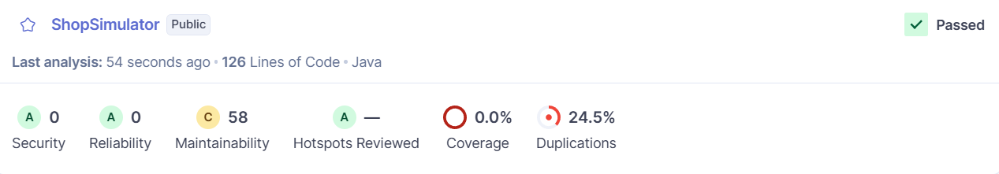
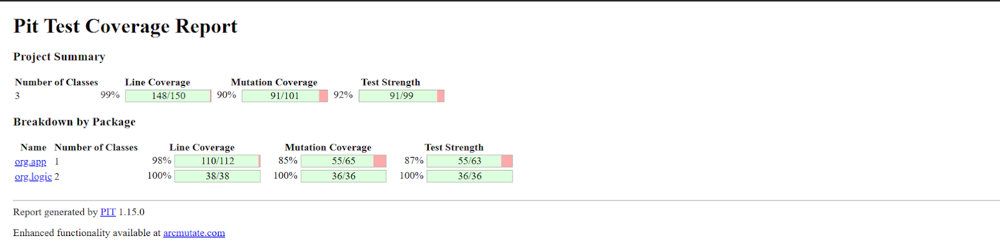
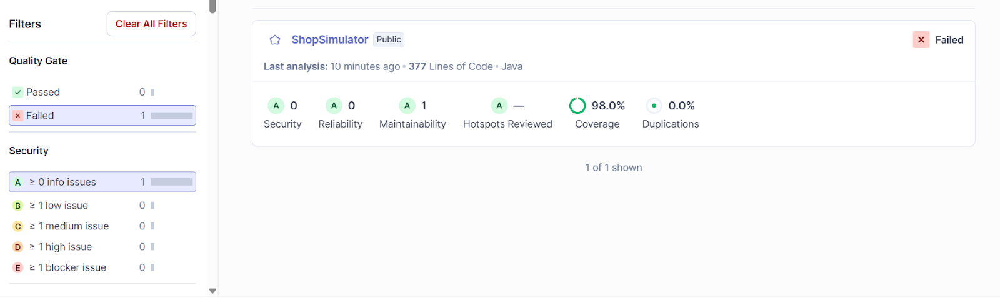
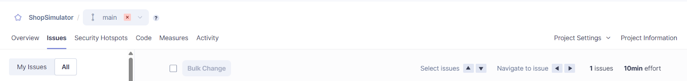

# Shop Simulator - REST API Inventory Management System

A modern Spring Boot REST API application for managing shop inventory with comprehensive endpoints and in-memory data storage.

## Overview

Shop Simulator is a backend inventory management system designed for small to medium-sized retail businesses. It provides RESTful API endpoints for managing products, tracking stock levels, and maintaining inventory data in memory.

## Features

### Core Functionality
- **Product Management**: Register, update, and track products with unique codes
- **Stock Control**: Increase or decrease product quantities with validation
- **Inventory Validation**: Check stock availability for required quantities
- **Low Stock Alerts**: Automatic alerts when products fall below threshold (5 units)
- **In-Memory Storage**: Data is stored in application memory during runtime

### API Features
- **REST API**: Full CRUD operations via HTTP endpoints
- **Real-time Statistics**: Inventory statistics and overview endpoints
- **Search & Filter**: Find products quickly by code or name via API
- **Alert Management**: View and clear low stock notifications via API
- **JSON Responses**: Structured data format for easy integration

## Architecture

The application follows a clean, layered architecture:

```
┌─────────────────┐
│ InventoryController │ ← REST API Layer
├─────────────────┤
│   SysInventory  │ ← Business Logic Layer
├─────────────────┤
│ Product/Validator│ ← Domain Models
└─────────────────┘
```

### Package Structure

- **`org.Main`**: Spring Boot application entry point
- **`org.controller.InventoryController`**: REST API endpoints
- **`org.dto.Dto`**: Data transfer objects for API requests/responses
- **`org.app.SysInventory`**: Core business logic and inventory management
- **`org.logic.Product`**: Product entity model
- **`org.logic.Validator`**: Input validation and business rules
- **`org.config.AppConfig`**: Spring Boot configuration class

## Installation & Setup

### Prerequisites
- Java 17 or higher
- Gradle 7.0 or higher

### Build Instructions

1. Clone the repository:
```bash
git clone <repository-url>
cd ShopSimulator
```

2. Build the project:
```bash
./gradlew build
```

3. Run the application:
```bash
./gradlew bootRun
```

4. Access the web interface:
Open your browser and navigate to `http://localhost:8080`

### Dependencies

- **Spring Boot**: Web framework with embedded Tomcat server
- **Jackson JSON Processor**: For JSON serialization/deserialization
- **JUnit 5**: For unit testing
- **Gradle**: Build automation and dependency management

## API Endpoints

### Product Management
- `GET /api/products` - List all products
- `POST /api/products` - Register new product
- `GET /api/products/{code}` - Get product by code
- `PATCH /api/products/{code}/stock` - Update stock quantity
- `GET /api/products/{code}/validate` - Validate stock availability

### Statistics & Alerts
- `GET /api/stats` - Get inventory statistics
- `GET /api/alerts` - Get low stock alerts
- `DELETE /api/alerts` - Clear all alerts

### Request/Response Examples

#### Register Product
```json
POST /api/products
{
  "code": "PROD001",
  "name": "Laptop",
  "price": 999.99,
  "quantity": 10
}
```

#### Update Stock
```json
PATCH /api/products/PROD001/stock
{
  "operation": "augment",
  "quantity": 5
}
```

#### API Response Format
```json
{
  "success": true,
  "message": "Product registered successfully",
  "data": { ... }
}
```

## Web Interface

### Navigation
- **Products**: View all products with search and filtering
- **Register**: Add new products to inventory
- **Stock**: Manage stock levels (increase/decrease)
- **Alerts**: View and manage low stock notifications

### Features
- **Real-time Statistics**: Dashboard showing total products, low stock items, and total value
- **Search Functionality**: Filter products by code or name
- **Stock Management**: Easy-to-use interface for stock operations
- **Alert System**: Visual indicators for low stock items
- **Responsive Design**: Optimized for both desktop and mobile use

### Data Storage

Data is stored in application memory during runtime. When the application restarts, all data is reset and the inventory starts empty.

## Validation Rules

### Product Validation
- **Code**: Alphanumeric characters only, required
- **Name**: Minimum 3 characters, required
- **Price**: Must be greater than 0
- **Quantity**: Must be non-negative

### Business Rules
- Product codes must be unique
- Stock reduction requires sufficient inventory
- Low stock threshold: 5 units
- Operation quantities must be positive

## Error Handling

The application provides comprehensive error handling:
- Input validation with descriptive error messages
- Graceful handling of missing data files
- Recovery from corrupted JSON files
- Detailed logging for debugging

## Development

### Running Tests
```bash
./gradlew test
```

### Code Quality
The project includes SonarQube integration for code quality analysis:
```bash
./gradlew sonar
```

Note: SonarQube requires compiled classes. The build.gradle file is configured with the necessary `sonar.java.binaries` properties.

### Project Structure
```
ShopSimulator/
└── src/
│   ├── main/
│   │   ├── java/
│   │   │   ├── org/
│   │   │   │   ├── Main.java
│   │   │   │   ├── controller/
│   │   │   │   │   └── InventoryController.java
│   │   │   │   ├── dto/
│   │   │   │   │   └── Dto.java
│   │   │   │   ├── app/
│   │   │   │   │   └── SysInventory.java
│   │   │   │   ├── logic/
│   │   │   │   │   ├── Product.java
│   │   │   │   │   └── Validator.java
│   │   │   │   └── config/
│   │   │   │       └── AppConfig.java
│   └── test/
│       └── java/
│           └── org/
│               ├── app/
│               │   └── SysInventoryTest.java
│               ├── controller/
│               │   └── InventoryControllerTest.java
│               ├── integration/
│               └── logic/
│                   ├── ProductTest.java
│                   └── ValidatorTest.java
├── .gitignore
├── build.gradle
├── gradlew
├── settings.gradle
├── gradlew.bat
├──README.md
└── settings.gradle
```

## Configuration

### Low Stock Threshold
Modify `MINIMUM_STOCK_ALERT` in `Validator.java` to change the alert threshold:
```java
public static final int MINIMUM_STOCK_ALERT = 5; // Default: 5 units
```

### Server Port
Default port is 8080. Override with:
```bash
./gradlew bootRun --args="--server.port=8081"
```

## Contributing

1. Follow Java naming conventions
2. Add appropriate validation for new features
3. Include comprehensive error handling
4. Write unit tests for new functionality
5. Update documentation for API changes
6. Test web interface functionality

## License

This project is licensed under the MIT License - see the LICENSE file for details.

## Version History

- **v2.0-SNAPSHOT**: Web application rewrite
  - Spring Boot REST API implementation
  - Modern responsive web UI with JavaScript modules
  - Real-time dashboard with statistics
  - In-memory data storage
  - Enhanced testing with comprehensive coverage
  - SonarQube integration with proper configuration
  - Fixed quantity validation to allow zero quantities
  - Updated project structure with organized static resources

- **v1.0**: Console application
  - Product registration and management
  - Stock control operations
  - JSON persistence
  - Low stock alerts
  - Comprehensive validation

## Code Quality & Analysis

This section documents the code quality analysis and technical debt tracking throughout the project development.

### Initial Analysis
The following image shows the first analysis performed on the initial codebase:



### Initial Technical Debt
The initial technical debt identified due to bad practices in the early development:


### Mutation Testing
Mutation testing performed with PITest after project updates and improvements:



### Updated SonarQube Analysis
Recent SonarQube scan showing the current state of code quality:



### Current Technical Debt
The current technical debt status after all improvements and refactoring:



## Support

For issues, questions, or contributions, please refer to the project's issue tracker or contact the development team.
